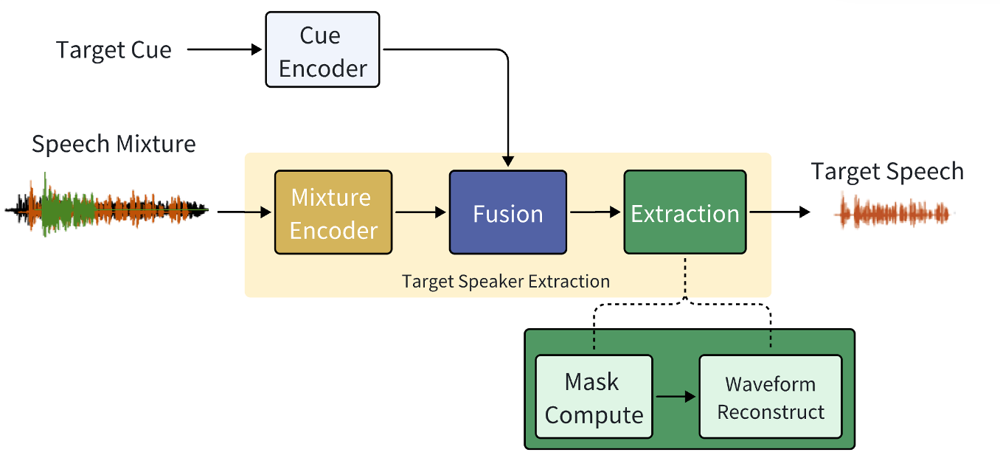
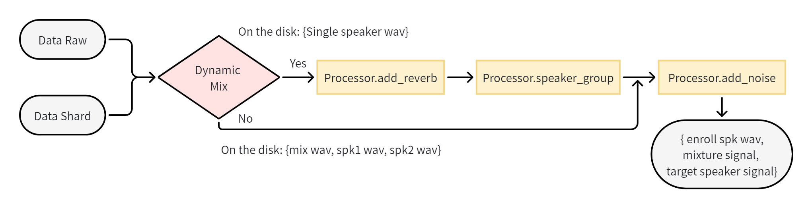

# Wesep

## Overview

> Target speaker extraction (TSE) focuses on isolating the speech of a specific target speaker from overlapped multi-talker speech, which is a typical setup in the cocktail party problem.
WeSep is featured with flexible target speaker modeling, scalable data management, effective on-the-fly data simulation, structured recipes and deployment support.

This version of **Wesep** is a **lightweight and competition-oriented release**. It is designed to:

- Provide a **reproducible training template**
- Support **official baseline system usage**
- Serve as a **reference implementation** for participants



### Install for development & deployment
* Clone this repo
``` sh
https://github.com/wenet-e2e/wesep.git
```

* Wesep is under active development and aims to support multi-cue inputs (speaker, visual, spatial, and semantic) as well as multiple modeling paradigms (discriminative, generative, and autoregressive).
``` sh
conda create -n wesep python=3.10
conda activate wesep

# Recommended (aligned with evaluation toolkit)
pip install torch==2.7.1 torchaudio==2.7.1
# Alternative (legacy GPUs, e.g. V100)
conda install pytorch=1.12.1 torchaudio=0.12.1 cudatoolkit=11.3 -c pytorch -c conda-forge

pip install -r requirements.txt
# speaker modeling support
pip install git+https://github.com/wenet-e2e/wespeaker.git@8f53b6485d9f88a207bd17e7f8dba899495ec794

pre-commit install  # for clean and tidy code
```

## Supported Features

### Model
- **BSRNN-based separator**
  - Causal
  - Non-causal

### Speaker Feature Representation Support

This version supports multiple types of **audio-based target speaker cues**:

- Speaker Embedding (via **WeSpeaker**)
- USEF Feature
- TF-Map Feature
- Contextual Embedding

### Datasets for training (Examples)
- Libri2mix
- Voxceleb1 (Online mixing)

## Pretrained Models

The checkpoints is availibale at [Google Drive](https://drive.google.com/uc?export=download&id=1M4UqK2A2EeHmQ0pCevYqBgaYn3RvklgC) . The directory structure for the pretrained models in the REAL-T project is suggested to be:

```
REAL-T/
├── pretrained/
│ ├── spk_emb_100/
│ │ ├── avg_model.pt
│ │ └── config.yaml
│ ├── spk_emb_causal_100/
│ ├── tfmap_context_100/
│ └── tfmap_context_causal_100/
```
To use a checkpoint for extracting a target speech from "mixture.wav" with "enroll.wav":
``` sh
python evaluate.py \
  --pretrain path/to/model_folder \
  --mixture path/to/mix.wav \
  --enroll path/to/enroll.wav \
  --output path/to/output.wav \
```

## Data Pipe Design

Following Wenet and Wespeaker, WeSep organizes the data processing modules as a pipeline of a set of different processors. The following figure shows such a pipeline with essential processors.




## Citations
If you find wesep useful, please cite it as

```bibtex
@inproceedings{wang24fa_interspeech,
  title     = {WeSep: A Scalable and Flexible Toolkit Towards Generalizable Target Speaker Extraction},
  author    = {Shuai Wang and Ke Zhang and Shaoxiong Lin and Junjie Li and Xuefei Wang and Meng Ge and Jianwei Yu and Yanmin Qian and Haizhou Li},
  year      = {2024},
  booktitle = {Interspeech 2024},
  pages     = {4273--4277},
  doi       = {10.21437/Interspeech.2024-1840},
}
```
